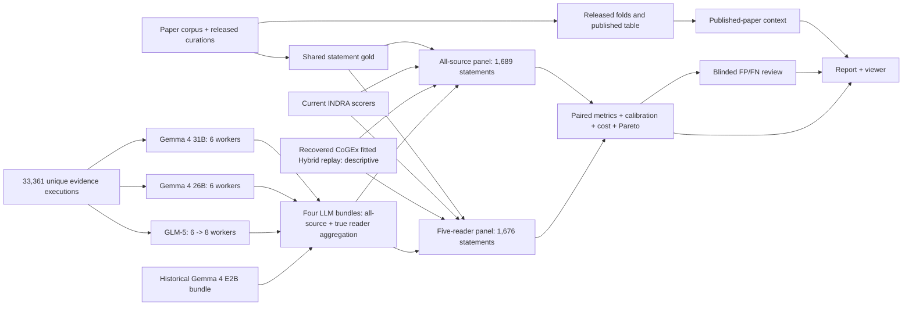

# INDRA belief comparison

Status: run complete 2026-07-23; publication artifact open. All four LLM
bundles are materialized (`data/comparison/models/`), all three primaries
carry `.COMPLETE` in `data/comparison/supervisor/`, and the final
10,000-resample metrics artifact
(`data/results/indra_belief_comparison_metrics.json`) carries every arm on
both panels. The blinded human review and the published report are the
remaining work. Sections below that read in the present tense about a
running fleet are the July 20-23 execution record; see the paid run plan for
the three quiescent amendments that closed it.
This is the only execution and handoff document for the comparison.

## Goal

Compare the 2023 INDRA belief methods, every relevant current INDRA scorer,
and the selected LLM scorers on shared statement-level gold. Publish paired
uncertainty, calibration, threshold errors, retry-inclusive cost, within-panel
Pareto frontiers, and a blinded human review of the remaining errors.

The result is not complete until the same final metrics artifact drives the
report and `/frontier?view=belief`.

## Scientific contract

- Prediction unit: assembled INDRA statement.
- Positive class: correct statement.
- Primary paper-compatibility target: preserve the released binary statement
  label—positive when the reviewed subset contained a positive tag, negative
  otherwise. This is the estimand used for direct comparison with the paper.
- Strict E0 sensitivity: positive when any exact evidence pair is reviewed
  positive; negative only when every exact evidence pair is reviewed negative;
  unresolved otherwise. Unknown is never coerced to incorrect in this lane.
- The released target is not described as complete evidence-level truth. Its
  documented statement-level negative assumption affects 111 statements:
  24.6% of all-source released negatives and 25.2% of reader released negatives.
- All arms in a direct panel use identical statement IDs, gold, folds, and
  evidence-universe semantics.
- The all-source and five-reader panels are separate estimands. Metrics,
  paired intervals, and Pareto frontiers never cross them.
- Five-reader LLM beliefs are recomputed from exactly the evidence generated by
  `{reach, sparser, medscan, rlimsp, trips}`. They are not a row subset of
  all-source statement predictions.
- Published 2023 table values are contextual until the corresponding method is
  semantically reconstructed on the shared statement-level gold. Rounded
  headline agreement does not recover the unpublished realized folds or fitted
  historical state.
- The fixed 403 curation set is a transfer/diagnostic substrate. Its pairs are
  unique and sampled without replacement, but the original frame and inclusion
  probabilities are not proven; it is not called a random representative
  population sample.
- Provider retries, invalid outputs, and failed attempts count toward cost.
  Every LLM cost binds the frozen AWS Bedrock `us-east-1` on-demand tariff,
  requests the `default` service tier, and records its resolved tier as
  `standard`; costs with another comparability identity do not share a Pareto
  frontier.
  Reader-panel cost is the exact observed five-reader execution subset of the
  shared run. Panel cost totals are not additive.

## Execution graph



## Evidence already complete

- Paper identity, released curations, folds, statement gold, and reproduction
  inputs are frozen locally.
- Paper panel: 1,689 all-source statements. Reader panel: 1,676 statements.
- Strict E0 resolves 1,578 all-source statements (1,237 positive, 341 negative)
  and 1,565 reader statements (1,236 positive, 329 negative); the same 111
  released negatives remain unresolved and are excluded only from the fixed
  sensitivity.
- Unique LLM execution substrate: 33,361 evidence identities. Multiplicity is
  retained separately; inference does not draw with replacement.
- Fixed transfer set: 403 unique curated pairs, 199 correct and 204 incorrect;
  12 repeated observations are excluded from the unique-pair analysis.
- The canonical scorer registry exhaustively records the current INDRA belief
  class surfaces and their benchmark decisions. Direct Simple, Bayesian
  source/source-subtype, Simple hierarchy, and Counts source/full-feature arms
  are materialized. The local Hybrid replay is a performance-identical Counts
  alias and is excluded rather than duplicated.
- The fitted Hybrid artifact referenced by the current CoGEx export path was
  recovered and replayed on both panels. It is descriptive only: this is not a
  live production capture, and neither training provenance nor deployment
  parity is established.
- Historical Gemma 4 E2B has 33,361 terminal predictions and all raw attempts.
  Its mixed-accounting cost descriptor reports a `$6.25697136`
  provider-measured lower endpoint and a `$6.36571104` conservative accounted
  upper endpoint; 59 calls lack complete provider token accounting and retain
  their exact reservations. Reader beliefs were independently reaggregated; 98
  of 1,676 differ from their all-source counterparts.
- The current metric engine computes paper trapezoidal PR-AUC, pooled average
  precision, AUROC, Brier, log loss, ECE, calibration intercept/slope,
  threshold metrics, paired bootstrap intervals, paired deltas, and panel-local
  point/uncertainty Pareto sets. Pareto performance uses the paper-compatible
  mean-fold trapezoidal PR-AUC; pooled average precision remains a distinct
  reported metric.
- The paid runner has passed an E2B smoke plus 52-case sensitivity gates for
  E2B, Gemma 4 26B, Gemma 4 31B, and GLM-5. The gates added `$0.54559798` of
  measured spend. The first empty GLM-5 answer remains immutable paid evidence;
  its authorized second attempt returned a valid verdict, leaving all 52 gate
  cases complete across 53 durable attempts.

## Current readout

The readout below is the July diagnostic, retained as the record of the
E2B-only stage. It is superseded: the shipped artifact
`data/results/indra_belief_comparison_metrics.json` is the 10,000-resample run
(`provenance.bootstrap_resamples = 10000`) and carries all four LLM arms
(`llm_gemma_4_e2b`, `llm_gemma_4_26b`, `llm_gemma_4_31b`, `llm_glm_5`) on both
the `paper_all_source` and `paper_readers` substrates. As written, the artifact
rendered at `/frontier?view=belief` was a fast
200-bootstrap diagnostic; it included the canonical INDRA arms and historical
E2B, while the other three LLM arms remained explicitly excluded. It must not be
presented as a released parity or superiority result. Gemma 4 E2B reaches
pooled average precision 0.9252 on the all-source panel and 0.9239 on the
five-reader panel. The fitted
full-feature CountsScorer reaches 0.9422 and 0.9367, respectively. The paired
E2B-minus-Counts differences are -0.0170 (diagnostic 95% interval
[-0.0272, -0.0075]) and -0.0128 ([-0.0246, -0.0038]).

At the universal 0.5 threshold, E2B F1 is 0.876 on both panels and differs from
Counts by only +0.0048 and +0.0028; both diagnostic intervals cross zero. Its
probability calibration is materially weaker: Brier is 0.164/0.166 versus
0.133/0.136 for Counts. E2B is the only costed model point; the viewer uses its
disclosed conservative `$6.36571104` upper endpoint, so calling the current
single point a cost/performance frontier would be vacuous. The frontier becomes
informative only after the remaining Gemma and GLM-5 bundles land.

The strict E0 sensitivity changes the apparent E2B performance materially:
all-source pooled average precision moves from 0.9252 to 0.9576 and Brier from
0.1637 to 0.1385; reader pooled average precision moves from 0.9239 to 0.9571
and Brier from 0.1661 to 0.1410. This is a fixed resolved-only sensitivity, not
a substitute primary panel, and costs/Pareto positions are not duplicated for
the selected subset. At threshold 0.5, 71 released-label false positives in
each panel fall in the 111-statement negative-assumption cohort.

The current diagnostic E2B readout has 313 threshold errors in each panel: 186
false positives and 127 false negatives on all-source; 184 false positives and
129 false negatives on five-reader. These counts are a workload diagnostic,
not a completed human-review artifact. The canonical codebook remains in pilot
status. Publication requires two real pilot ledgers and an explicit human
codebook freeze, then two independent humans reviewing the complete blinded
panel censuses. A third human resolves every reviewer disagreement and no
agreement. The final report gives exact descriptive defensibility proportions,
pre-resolution agreement, all resolutions, dimensions, and taxonomy comments;
it does not attach IID or binomial confidence intervals to the fixed census.

## Frozen provider pricing

All four LLM bundles use one structured cost contract: AWS Bedrock on-demand
inference in `us-east-1`, `service_tier=default` resolved to Standard, USD per
million provider tokens, with list prices retrieved on 2026-07-21.

| Provider model | Input / 1M tokens | Output / 1M tokens |
| --- | ---: | ---: |
| Gemma 4 E2B | `$0.04` | `$0.08` |
| Gemma 4 26B A4B | `$0.13` | `$0.40` |
| Gemma 4 31B | `$0.14` | `$0.40` |
| GLM-5 | `$1.00` | `$3.20` |

The bundle records the source URL, retrieval date, region, requested and
resolved service tiers, provider model ID, rates, and common cost-comparability
identity. The all-source view reports every observed execution; the reader view
reports the exact observed five-reader subset of that same run. Neither is a
counterfactual price projection, and the two panel totals must never be added.

## Paid run plan

The approved combined ceiling is `$400`, inclusive of the historical E2B
accounting charge. After charging its conservative `$6.36571104` upper
endpoint, the append-only paid-run ledger has a `$393.63428896` global cap.
Live remaining authority is derived from that ledger rather than frozen in this
document.

| Gate | Action | Rows | State / maximum action authority |
| ---: | --- | ---: | ---: |
| 1 | E2B single-call smoke | 1 | complete — `$0.00020652` |
| 2 | E2B prompt sensitivity | 52 | complete — `$0.00975268` |
| 3 | Gemma 4 26B prompt sensitivity | 52 | complete — `$0.04332150` |
| 4 | Gemma 4 31B prompt sensitivity | 52 | complete — `$0.03650828` |
| 5 | GLM-5 prompt sensitivity | 52 | complete in 53 attempts — `$0.4558090` |
| 6a | Gemma 4 31B primary | 33,361 | complete (33,361/33,361) — max `$39.96349172` |
| 6b | Gemma 4 26B primary | 33,361 | complete (33,361/33,361) — max `$39.95667850` |
| 6c | GLM-5 primary | 33,361 | complete (33,361/33,361) — max `$309.544191` |

Sensitivity extrapolations remain planning diagnostics, not reported run
costs. The frozen dependency graph now releases all three primaries together.
Each started at six Bedrock workers, for 18 concurrent provider calls across
models; the third amendment raised `glm_5_primary` to eight after both Gemma
primaries completed.
Initial live throughput implies roughly 16--25 hours of wall time, with GLM-5
the likely longest pole; long-tail calls can move that estimate.

Each dependency-ready action has an explicit spend lane. The plan statically
bounds the combined maximum exposure of independent lanes within each model
stage and within the `$393.63428896` comparison ceiling; the historical E2B
cost then closes the total at no more than `$400`. Local inputs, output resume
state, execution identities, and spend capacity are checked before the bearer
token is read. Each call reserves its maximum cost before network I/O. Raw
attempts and spend ledgers are append-only and resumable. Each completed LLM
bundle records the exact canonical run-plan bytes, SHA-256, and relative path,
then rechecks that capture immediately before publishing its manifest.

Three quiescent amendments have frozen, each while every runner was
stopped. The first froze at `2026-07-20T20:54:55Z`, binding
predecessor plan
`3df052479f89e03798b6ce5f4f03f76767c837ff1a4d7f5932d099fe4221da0c`
to amended plan
`e04bbb7b75b9c9ee2bbf85d799eb646bbf914c898f18bca59066de0a89bbcf3f`
with semantic diff `max_attempts: 5 -> 6` on the three primary actions,
permitting one ordinal-six retry for the eleven transport-failed executions.
The second froze at `2026-07-21T12:05:41Z` after a second local network
transition exhausted seven further executions at ordinal six (two Gemma 31B,
one Gemma 26B, four GLM-5). It binds the same original predecessor
`3df052479f89e03798b6ce5f4f03f76767c837ff1a4d7f5932d099fe4221da0c`
to amended plan
`225683626023e138f9caadbaab8b0836fe2ef7e894ee04a3c5cd286aaaeb26e4`
with cumulative semantic diff `max_attempts: 5 -> 10` on the same three
actions; the superseded intermediate plan is archived at
`data/comparison/plan_history/run_plan.e04bbb7b75b9.json`. The enlarged bound
recovers the seven exhausted executions and lets in-flight executions ride
out multi-minute transport outages under exponential backoff instead of
exhausting within about two minutes. For both amendments the inverse
reconstruction matches the original predecessor bytes exactly, and
identities, workloads, paths, concurrency, deadlines, and every dollar cap
are unchanged. The third froze at `2026-07-22T05:03:33Z`, after both Gemma
primaries completed (33,361/33,361 each, status-verified): it raises
`glm_5_primary` from six workers to the contract's eight-worker ceiling,
restoring part of the idle concurrency (peak load was eighteen concurrent
calls across three arms with no throttling). It binds the same original
predecessor to amended plan
`ce4a4cd44b2bc1add88b0b983b75de2276d7a49a9fa108bda727ff62b8548ae1`
with cumulative semantic diff `max_attempts: 5 -> 10` on the three primary
actions plus `workers: 6 -> 8` on `glm_5_primary`; the superseded plan is
archived at `data/comparison/plan_history/run_plan.225683626023.json`. The
amendment contract now admits exactly two canonical transitions —
`max_attempts` 5 -> 10 and `workers` 6 -> 8 (`AMENDABLE_FIELDS`), both
bounded by the reviewed ceilings — and every amendment binds the original
predecessor. For all amendments the inverse reconstruction matches the
original predecessor bytes exactly. Archived predecessor plans are
historical bytes for hash verification, not loadable artifacts: the
single-cumulative-amendment contract validates only the current plan form,
exactly as the original (amendment-free) plan predates the amendment field
itself. Completed model bundles record the plan bytes current at their
materialization (both Gemma bundles bind the second amended plan); the
recorded captures resolve through the archive, and bundle assembly binds
predictions and cost ledgers to bundle-local descriptors, not to the live
plan file. `max_attempts` bounds transport-class retries only: invalid
model output remains capped at two attempts by the runner, and non-retryable
provider failures still stop an action immediately, so the bound is
semantically neutral for scoring.

## Canonical implementation

```text
src/indra_belief/comparison/
  contracts.py   shared JSON, descriptors, and run-plan types
  replay.py      prompt replay and execution identities
  runner.py      dependency-ready paid execution and resume
  llm.py         raw attempts to all-source/reader model bundles
  production.py  fitted CoGEx Hybrid bundle validation
  assemble.py    shared-gold panels and metric-input specification
  metrics.py     paired metrics, calibration, cost, and Pareto
  report.py      Markdown/HTML from the metrics artifact
  inputs.py      the one explicit set of comparison inputs
  error_review.py outcome-blind census, independent review, and resolution
  cli.py         status, run, materialize, metrics, report
src/indra_belief/spend_guard.py
                 append-only action spend lanes and cap guard
```

`data/comparison/scorers.json` is the one scorer registry and
`data/comparison/pricing.json` is the one comparison-pricing contract. There is
one run plan, one explicit input file, and one comparison entry point.

After each primary action is complete, its canonical bundle is derived from
the frozen plan and the ordered model declaration; model, provider, run, input,
ledger, and output identities are not accepted as command-line overrides:

```bash
PYTHONPATH=src .venv/bin/python -m indra_belief.comparison model-bundle --action gemma_26b_primary
PYTHONPATH=src .venv/bin/python -m indra_belief.comparison model-bundle --action gemma_31b_primary
PYTHONPATH=src .venv/bin/python -m indra_belief.comparison model-bundle --action glm_5_primary
```

Once all three manifests exist, set the final freeze timestamp and 10,000
bootstrap resamples in the same input file, then run `materialize`, `metrics`,
the two-reviewer workflow, `report`, and the publication validator in that
order.

## Remaining work

- Complete the human pilot and freeze the codebook; run both independent
  blinded full-census reviews, resolve every disagreement, and report exact
  defensible and non-defensible error counts and proportions.
- Publish the report and verify that the viewer reads the identical metrics
  artifact.

Done, and kept here as the closing record: the three concurrent primaries ran
to 33,361/33,361 each; all four canonical LLM bundles are materialized with
independently aggregated all-source and reader predictions; and the
10,000-resample metrics artifact replaced the 200-resample diagnostic.

## Known limitations that must remain visible

- The fixed 403 transfer set does not establish population-representative
  sampling.
- The paper's published aggregate table and this shared-gold comparison are
  related but not automatically identical estimands; the report labels which
  values are published, semantically reconstructed, or directly paired.
- The recovered CoGEx Hybrid replay has incomplete private training provenance
  and is descriptive rather than confirmatory. Its training-data digest is
  unknown, not inferred from the evaluation corpus.
- Model-generated explanations are not human adjudications. Error
  defensibility is unavailable until the blinded review is signed and resolved.
